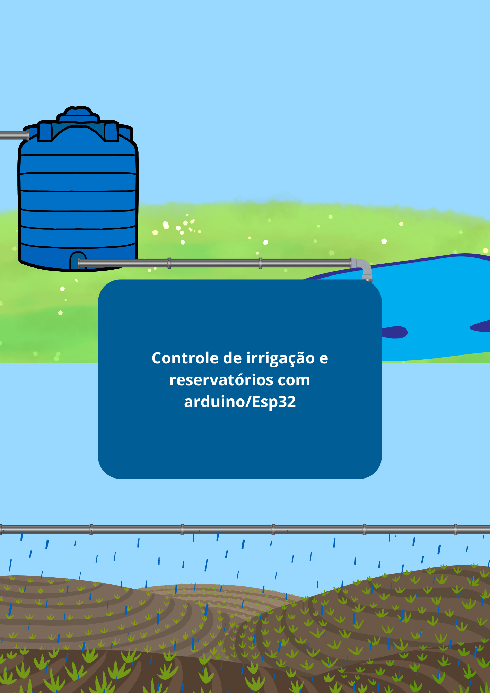
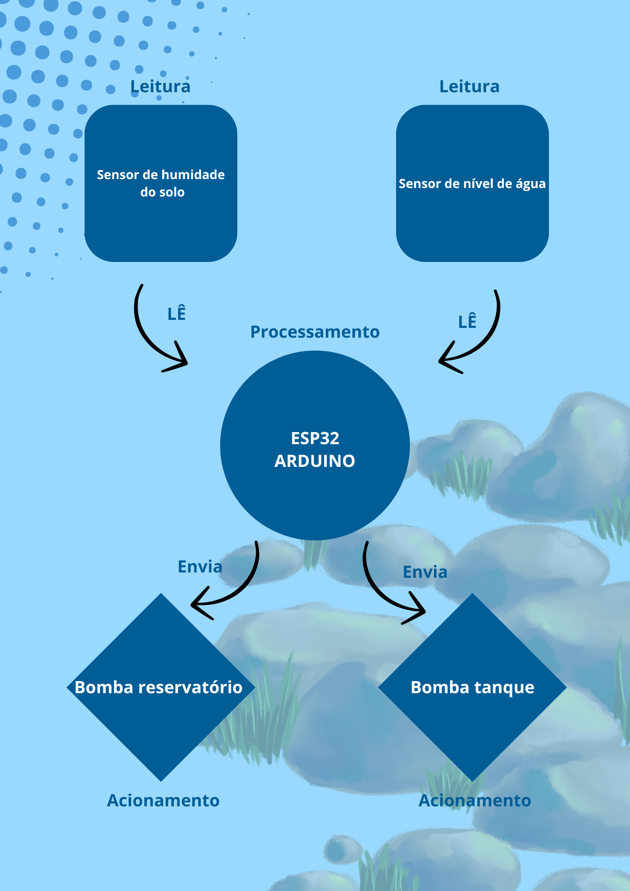
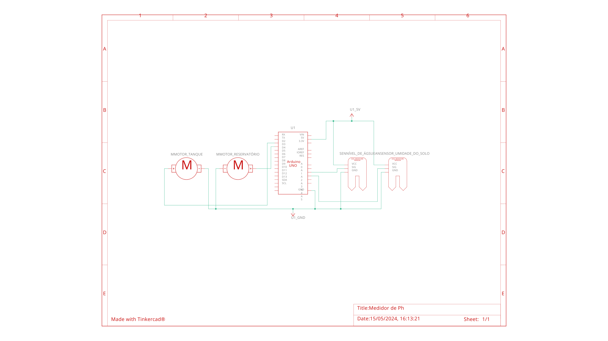

# Resumo da documentação e código da parte técnica

## Introdução

Este manual visa fornecer orientações detalhadas para a montagem e configuração dos processadores do controle de irrigação. Ele é destinado aos instaladores e à equipe de instalação, fornecendo instruções passo a passo para garantir uma montagem adequada e a configuração correta dos componentes.

## Componentes Utilizados

-   **Sensores:**
    
    -   Sensor de Nível de Água (SN)
    -   Sensor de Umidade do Solo (SUS)
    - 
-   **Bombas de Água:**
    
    -   Bomba do Reservatório (B1)
    -   Bomba do Tanque (B2)
    - 
-   **Microcontrolador:**
    
    -   Arduino (ou similar)
    - Esp32 (wroom para monitoramento em cloud)

## Esquema de leitura:

## Esquema Elétrico:

## Funcionamento

1.  **Configuração Inicial:**
    
    -   Os pinos dos sensores e das bombas são definidos no código.
2.  **Loop Principal:**
    
    -   O programa entra em um loop infinito para monitorar continuamente os valores dos sensores.
3.  **Leitura dos Sensores:**
    
    -   São feitas leituras analógicas dos sensores de nível de água (SN) e umidade do solo (SUS).
4.  **Verificação das Condições:**
    
    -   O sistema verifica se o nível de água está abaixo de um limite pré-definido e se a umidade do solo está abaixo de um limite pré-definido.
5.  **Acionamento das Bombas:**
    
    -   Se o nível de água estiver baixo, a bomba do reservatório (B1) é acionada. Se a umidade do solo estiver baixa, a bomba do tanque (B2) é acionada.
6.  **Monitoramento via Serial:**
    
    -   Informações sobre as ações tomadas são enviadas via comunicação serial para monitoramento em tempo real.
7.  **Aguardando Intervalo de Tempo:**
    
    -   Após cada iteração do loop, há um atraso de 1 segundo antes da próxima execução.

## Conclusão

Este manual fornece as instruções necessárias para montar e configurar os processadores do controle de irrigação. Ao seguir corretamente as etapas descritas, os instaladores e a equipe de instalação podem garantir o funcionamento adequado do sistema de irrigação automatizado.
Resumo da documentação e código da parte técnica
Introdução
Este manual visa fornecer orientações detalhadas para a montagem e configuração dos processadores do controle de irrigação. Ele é destinado aos instaladores e à equipe de instalação, fornecendo instruções passo a passo para garantir uma montagem adequada e a configuração correta dos componentes.

Componentes Utilizados
Sensores:

Sensor de Nível de Água (SN)
Sensor de Umidade do Solo (SUS)
Bombas de Água:

Bomba do Reservatório (B1)
Bomba do Tanque (B2)
Microcontrolador:

Arduino (ou similar)
Esp32 (wroom para monitoramento em cloud)
Funcionamento
Configuração Inicial:

Os pinos dos sensores e das bombas são definidos no código.
Loop Principal:

O programa entra em um loop infinito para monitorar continuamente os valores dos sensores.
Leitura dos Sensores:

São feitas leituras analógicas dos sensores de nível de água (SN) e umidade do solo (SUS).
Verificação das Condições:

O sistema verifica se o nível de água está abaixo de um limite pré-definido e se a umidade do solo está abaixo de um limite pré-definido.
Acionamento das Bombas:

Se o nível de água estiver baixo, a bomba do reservatório (B1) é acionada. Se a umidade do solo estiver baixa, a bomba do tanque (B2) é acionada.
Monitoramento via Serial:

Informações sobre as ações tomadas são enviadas via comunicação serial para monitoramento em tempo real.
Aguardando Intervalo de Tempo:

Após cada iteração do loop, há um atraso de 1 segundo antes da próxima execução.
Conclusão
Este manual fornece as instruções necessárias para montar e configurar os processadores do controle de irrigação. Ao seguir corretamente as etapas descritas, os instaladores e a equipe de instalação podem garantir o funcionamento adequado do sistema de irrigação automatizado.

Markdown selection 2045 bytes 304 words 50 lines Ln 51, Col 276HTML 1503 characters 274 words 30 paragraphs
You've earned 1 badge: "Renamer".